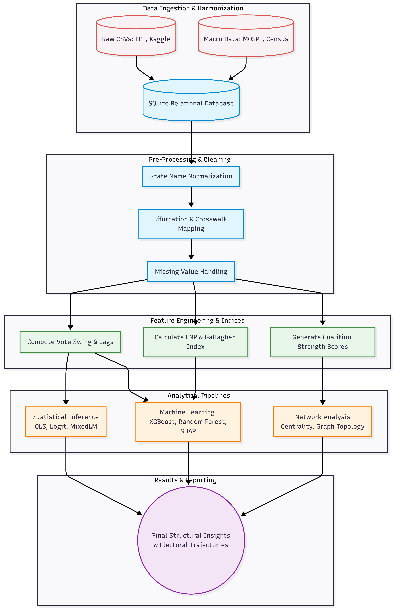

# Electoral Democracy in India (1947–2025): A Data-Driven Analysis of Fragmentation, Volatility, and Coalition Networks

  
The working paper draft associated with this codebase is indexed via Crossref and hosted on the SSRN Electronic Journal:  
🔗 **Read the Paper:** [https://doi.org/10.2139/ssrn.6873638](https://doi.org/10.2139/ssrn.6873638)

---

## Project Overview
This repository contains the complete Python codebase, feature engineering pipelines, and machine learning models used to evaluate the structural drivers of Indian parliamentary elections from 1951 to 2024. By harmonizing disparate historical records into a unified relational database, this project transitions the study of Indian electoral democracy from qualitative narratives to reproducible data science.

## Project Structure
The repository is organized chronologically to ensure full reproducibility of the data pipeline and statistical models:

*   **`RawData/`**: Place downloaded CSVs here.
*   **`FilteredData/`**: Intermediate datasets following initial boundary and missing-value audits.
*   **`ProcessedData/`**: Cleaned outputs and finalized analytical feature arrays.
*   **`ReferenceData/`**: Crosswalk tables and historical party metadata.
*   **`Sub Datasets/`**: Segmented data blocks categorized by political epoch.
*   **`electoral_india.db`**: The normalized SQLite database acting as the core data engine.
*   **`state_normalization.py`**: Reusable state name normalization module resolving spelling variants.
*   **`queries.sql`**: Optimized extraction queries for downstream Pandas integration.
*   **`requirements.txt`**: Complete list of Python dependencies for local replication.

### Execution Pipeline (Jupyter Notebooks)
*   **`01_data_collection.ipynb`**: Automated ingestion of raw tables into the SQLite environment. 
*   **`02_data_cleanup_and_filteration.ipynb`**: Resolution of party nomenclature, missing value handling, and spatial crosswalk mapping.
*   **`03_feature_engineering.ipynb`**: Computation of vote swing, historical lags, binary incumbency flags, and coalition strength scores.
*   **`04_eda.ipynb`**: Exploratory data analysis, turnout mapping, and temporal visualizations.
*   **`05_indices.ipynb`**: Calculation of the Party Dominance Index (PDI), Pedersen Volatility, Effective Number of Parties (ENP), and Gallagher disproportionality index.
*   **`06_statistical_models.ipynb`**: Multivariable OLS, Logit victory probability modeling, Mixed-Effects (MixedLM) estimation, and ARIMA forecasting.
*   **`07_machine_learning_models.ipynb`**: XGBoost and Random Forest classification, SHAP feature importance extraction, and K-Means/Hierarchical clustering of state typologies.
*   **`08_network_analysis_of_colation.ipynb`**: Construction of undirected graphs mapping pre-poll alliances and extraction of degree/betweenness centrality metrics.

---

## RawData Files Required
To replicate this study, download the following datasets and place them in the `RawData/` directory with the specified filenames:

| Filename | Source |
|---|---|
| `election_results_1951_2019.csv` | Kaggle (ramaasivashankar) |
| `loksabha_1962_2019.csv` | Kaggle (prabinraj) |
| `election_results_2024.csv` | OpenCity.in|
| `ref_party_master_1962_2021.csv` | Kaggle (jehanbhathena)|
| `election_constituency_summary.csv` | dataful.in/datasets/19985 |
| `literacy_1951_2011.csv` | data.gov.in |
| `parliament_1951_2014.csv` | github.com/datameet |
| `state_sdp_2011_2023.csv` | mospi.gov.in |
| `state_gdp_share_1960_2023.csv` | dataful.in/datasets/2024 |

---
## Project Methodology
Below is the structural flow of the data engineering and machine learning pipelines utilized in this research:

---

## Key Design Decisions

### State Name Standardization & Bifurcation Logic
All raw state name variants are mapped through a robust tracking dictionary. Historical state names (Bombay, Madras, PEPSU, etc.) are mapped to their canonical successors. The pipeline utilizes bifurcation-aware logic to handle year-dependent spatial reassignments, ensuring longitudinal consistency across the following major events:

| Year | Event |
|---|---|
| 1947–1956 | Multiple states (PEPSU, Hyderabad, Madhya Bharat, Vindhya Pradesh, Travancore-Cochin) merged/reorganized |
| 1960 | Bombay → Maharashtra + Gujarat |
| 1963 | Nagaland statehood |
| 1966 | Punjab → Punjab + Haryana |
| 1969 | Madras → Tamil Nadu (rename) |
| 1971 | Himachal Pradesh statehood |
| 1972 | Manipur, Meghalaya, Tripura statehood |
| 1973 | Mysore → Karnataka (rename)  |
| 1975 | Sikkim accession  |
| 1987 | Goa, Mizoram, Arunachal Pradesh statehood  |
| 2000 | UP → Uttarakhand; Bihar → Jharkhand; MP → Chhattisgarh  |
| 2011 | Orissa → Odisha (rename)  |
| 2014 | Andhra Pradesh → Andhra Pradesh + Telangana  |
| 2019 | J&K → J&K UT + Ladakh UT  |

---

## Key Empirical Findings
1. **The Incumbency Premium:** Sitting incumbents enjoy a statistically robust vote-share premium of approximately 20 to 22 percentage points over non-incumbents, overpowering regional economic fluctuations.
2. **Coalitions as Power Multipliers:** Pre-poll alliances function as critical institutional power multipliers; coalition strength scores serve as the second highest predictor of constituency victory in XGBoost and Random Forest ensembles.
3. **Network Centralization:** Alliance networks have expanded exponentially, evolving from 206 parties and 20,303 links in 1996 to a highly centralized, bi-polar architecture of 674 parties and 224,117 links in 2019.
4. **Cyclical Disproportionality:** The Gallagher and Loosemore-Hanby indices prove that electoral disproportionality in India operates cyclically—peaking during eras of single-party dominance and plummeting during the highly fragmented coalition era (1989–2009).

## How to Run
1. Clone this repository to your local machine.
2. Install the required dependencies by running `pip install -r requirements.txt`.
3. Download the necessary raw data files listed above and place them in the `RawData/` directory .
4. Execute the Jupyter Notebooks sequentially from `01` to `08`.

---
*Last updated: June 2026*

## Authors

**Sagar Maindola**  
Independent Researcher  
Department of Computer Science,  
Graphic Era University, Dehradun

**Prerna Doodraj**  
PGT Political Science  
Researcher – Political Science & Institutional Analysis

